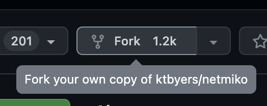
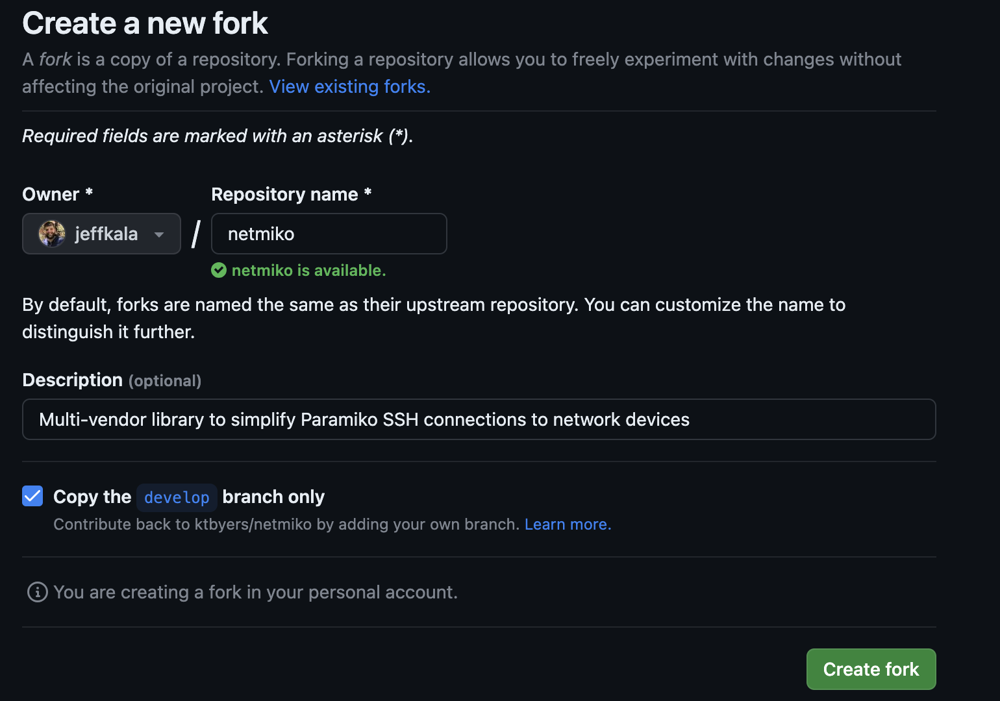
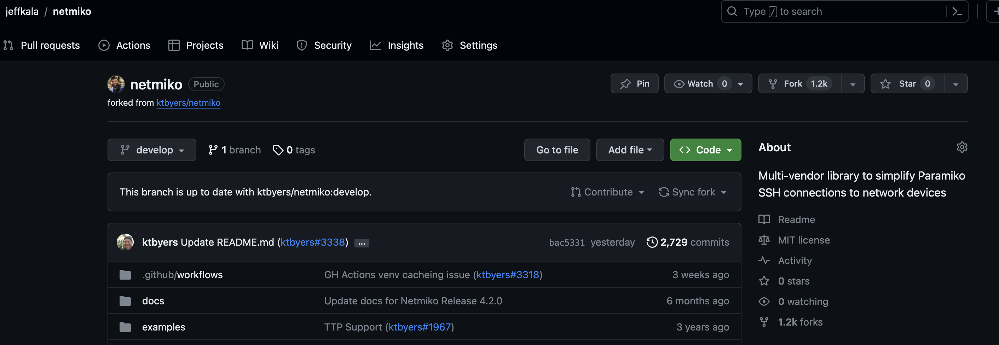
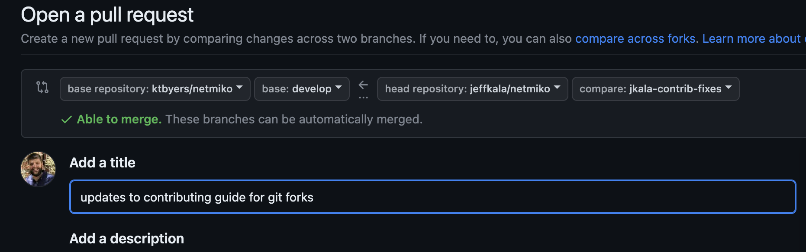

### Contributing to Netmiko

In order to contribute to Netmiko without having to be directly added as a contributor to this project it is best to follow the well known forking strategy. Follow the steps below to fork Netmiko and contribute back to the project from your personal fork.

#### Navigate and Fork Netmiko Repository

Navigate to the Netmiko project on GitHub. Once you're on the main repository page click on the fork button.



You'll then be brought to a screen to complete the fork into your personal user repository.



You'll finally be redirected to your fork of Netmiko, which is linked to the parent Netmiko repository.



#### Clone the Netmiko repository

Next you'll need to clone your forked repository.

```
▶ git clone git@github.com:<gituser>/netmiko.git
Cloning into 'netmiko'...
remote: Enumerating objects: 17427, done.
remote: Counting objects: 100% (753/753), done.
remote: Compressing objects: 100% (417/417), done.
remote: Total 17427 (delta 395), reused 611 (delta 323), pack-reused 16674
Receiving objects: 100% (17427/17427), 7.37 MiB | 8.25 MiB/s, done.
Resolving deltas: 100% (11334/11334), done.
```

Once your forked repository is cloned you can change into the netmiko directory.

```
cd netmiko
```

Finally you can check the status of git.

```
git status
```

Git Status should look similar to the following:

```
$ git status
On branch develop
Your branch is up to date with 'origin/develop'.

nothing to commit, working tree clean

```

#### Install Poetry 

Poetry is used to manage the dependencies needed for the Netmiko development environment. 

Make sure that you add Poetry to your $PATH.

[Poetry Install](https://python-poetry.org/docs/#installing-with-the-official-installer)

```
# Verify Poetry is installed and in your $PATH

$ poetry --version
Poetry (version 1.x.y)
```

#### Use Poetry to install Netmiko dependencies

This will also create a virtual environment located in .venv.

```
# From the base of the Netmiko repository (the directory should contain the pyproject.toml file).
$ poetry install
<"Installing x"...>
```

#### Activate virtual environment that has all the needed dependencies:

```
source .venv/bin/activate
```

#### Test your environment is working right:

```
# Should report all files as 'unchanged'
$ black --check .
All done! ✨ 🍰 ✨
264 files would be left unchanged.

# Linter should report nothing (at this point)
$ pylama .

# Type hints should be happy 😃
$ mypy netmiko/
Success: no issues found in 194 source files
```

Unit tests should pass (once again we are testing on unchanged 'develop' branch at this point so everything should pass)

```
$ py.test tests/unit/
============================= test session starts ==============================
platform linux -- Python 3.9.12, pytest-7.1.2, pluggy-1.3.0
rootdir: /home/ktbyers/netmiko_tmp/netmiko, configfile: setup.cfg
plugins: pylama-8.3.8
collected 58 items                                                             

tests/unit/test_base_connection.py ........................              [ 41%]
tests/unit/test_connection.py ....                                       [ 48%]
tests/unit/test_entry_points.py .                                        [ 50%]
tests/unit/test_ssh_autodetect.py .                                      [ 51%]
tests/unit/test_utilities.py ............................                [100%]

============================== 58 passed in 6.41s ==============================
```

#### Create a branch for your work:


```
$ git checkout -b my_cool_work origin/develop
branch 'my_cool_work' set up to track 'origin/develop'.
Switched to a new branch 'my_cool_work'
```

#### Make your changes pass the linters and tests. 

At the end of your changes the linters and unit tests MUST all pass.

```
cd {{ repo_base }}
# Use black to autoformat the code
black .

# Fix any linting errors
pylama .

# Type hints (if you struggle with this, submit PR and ask for assistance)
mypy netmiko/

# Unit tests
$ py.test tests/unit/
```

#### Submit your PR to the Netmiko repository. 

Place a clear statement regarding the purpose of the PR (bug it is fixing, feature it is adding).

For any more meaningful feature, you should open a GitHub issue or discussion first and make sure that we agree on implementing this feature.

The PR will will be sourced from your forked repository + the forked repository branch in use, with the destination of Netmiko's develop branch.


